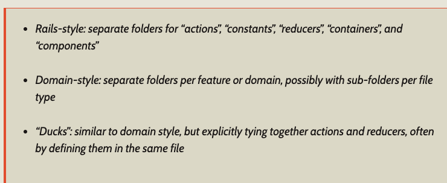

# Setup
 - `npm install`

# Run iOS
- `react-native run-ios`

# Modules Installed
- Redux - `npm install redux`
- React redux - `npm install react redux`
- [KeyMirror](https://www.npmjs.com/package/keymirror) - `npm install keymirror`
- [Redux-Thunk](https://github.com/reduxjs/redux-thunk) - `npm install redux-thunk`
- React Native Navigation - `npm install react-native-navigation`
# Known issues
- Cannot connect to browser debugger -https://stackoverflow.com/questions/55131047/react-native-debugger-error-cannot-get-debugger-ui

- No Bundle URL Present
  - cd into /ios
  - Remove the build folder with rm -r build
  - Run react-native run-ios again


# Project Structure
Separation by *Domain*/*feature* instead of by *Nature*/*fuction*, utilizing file suffix to differentiate between **actions**, **components**, etc<br>
Why?:
- New developers coming in would only need to go into only a single folder to work on a specific feature 
- When we add/change specific feature, some group of objects tend to have to change together. This way we don't have to go digging to see what files are affected for X feature
- Experience with old structure
  - Reference(s):
    - [redux.js](https://redux.js.org/faq/code-structure#what-should-my-file-structure-look-like-how-should-i-group-my-action-creators-and-reducers-in-my-project-where-should-my-selectors-go)
    - [React dir structure](https://marmelab.com/blog/2015/12/17/react-directory-structure.html)
    - [React organize by feature](https://jaysoo.ca/2016/02/28/organizing-redux-application/#rule-1-organize-by-feature)

- 

NEW:<br>
- /android - Native Android project <br>
- /ios - Native iOS project <br> 
- /core <br>
 &ensp; /components <br>
  - shared components utilized all over the app
- &ensp; /feature1 <br>
  - featureReducer.js
  - featureAction.js
  - featureView.js
- &ensp; /feature2 <br>
- &ensp; /<feature#> <br>
- &ensp; /utils<br>
- &ensp; /network<br>
- rootReducers.js
  - instantiate all the reducers here
- rootStore.js
  - instantiate the store
- views.js
  - registration of views for Navigation (RNN)

OLD:<br>
~~/android - Native Android project <br>
/ios - Native iOS project <br> 
/core <br>
 &ensp; /actions <br>
 &ensp; /components <br>
 &ensp; /network <br>
 &ensp; /reducers <br>
 &ensp; /views <br>~~

Separate js files for styles
  - i.e 
  ```
    - /views
      - /counter
        - CounterView.js
        - styles.js 
  ```


Code style
  - camelCase for files
  - 2 spaces
  - no semicolons

# Documentations
- Implementation docs and progress [here](documentations/README.md)

# Redux Architecture
