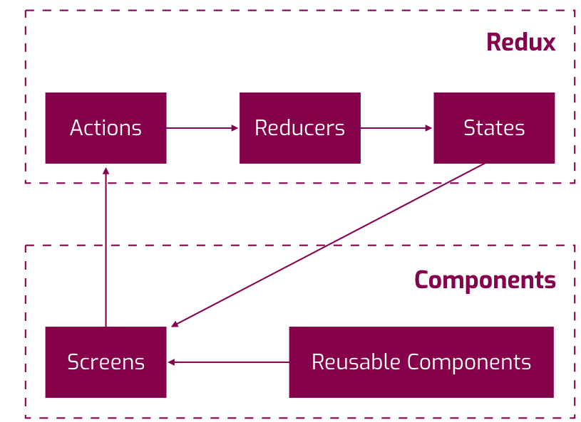

# Setup
 - `npm install`

# Run iOS
- `react-native run-ios`

# Modules Installed
- Redux - `npm install redux`
- React redux - `npm install react redux`
- [KeyMirror](https://www.npmjs.com/package/keymirror) - `npm install keymirror`
- [Redux-Thunk](https://github.com/reduxjs/redux-thunk) - `npm install redux-thunk`

# Known issues
- Cannot connect to browser debugger -https://stackoverflow.com/questions/55131047/react-native-debugger-error-cannot-get-debugger-ui

- No Bundle URL Present
  - cd into /ios
  - Remove the build folder with rm -r build
  - Run react-native run-ios again

# Project Structure
/android - Native Android project  
/ios - Native iOS project   
/core  
 &ensp; /actions  
 &ensp; /components  
 &ensp; /network  
 &ensp; /reducers  
 &ensp; /views  

# Redux Architecture
