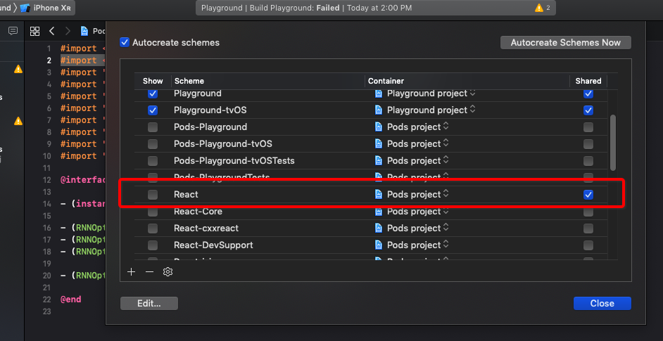

# React Native Navigation (RNN)
- Implemented on branch 'navigation-RNN'
- Utilize Redux in implementation - [guide](https://wix.github.io/react-native-navigation/#/docs/top-level-api-migration?id=registering-screens-with-wrapping-provider-component)
# Installs
- `npm install react-native-navigation`
  - I currently have v3.0.0 at the time of this doc

# Setup iOS - [Guide](https://wix.github.io/react-native-navigation/#/docs/Installing)
- Import the module `/node_modules/react-native-navigation/lib/ios/ReactNativeNavigation.xcodeproj` to the ios project/libraries through xcode
- In your xcode project settings, go to your app's target > Build Phases > Link Binary With Libraries
- ~~add the `libReactNativeNavigation.a`~~
- Build the xcode project to make sure everything is good

# Setup Android 
- TBA

# Common Problems
- "`RCTConvert.h not found`" after importing in React Native Navigation
  - **solution**:
    - make sure the 'React' library/pod is included
    - go to Product > Scheme > Manage Scheme
      
- When building xcode after importing the ReactNativeNavigation proj, it's possible you run into an error saying it can't find the `libReactNativeNavigation.a`
  - I just removed it from the "Build Phases" to fix it

# What I learned
- Entry point is `/RN-Playground/index.js`
- You must register your views/component before you can add that to the stack
- Set the root in the index file with whatever View you want to start with
- Navigate can be done via - these [API's](https://wix.github.io/react-native-navigation/#/docs/screen-api)
- 'componentId' props property lets the Navigation API know who's navigation

# Reference
- [Stack navigation video](https://www.youtube.com/watch?v=bVjJEAPGLNk)